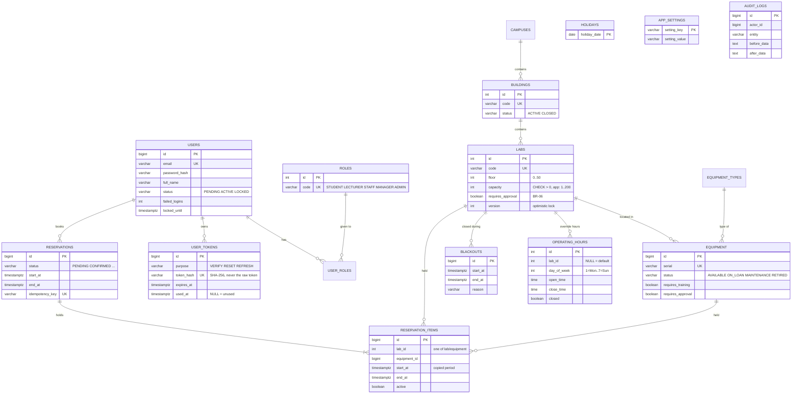

# ERD v0.1 (D10) — đúng với Flyway V1…V7

## Ràng buộc (invariant)
| Bảng | Ràng buộc | Vì sao |
|---|---|---|
| users | `email` UNIQUE, status ∈ {PENDING, ACTIVE, LOCKED} | BR-01, một email một tài khoản |
| user_tokens | `token_hash` UNIQUE; chỉ lưu hash | lộ DB không lộ token (BR-03) |
| labs | `code` UNIQUE, `capacity > 0`, `floor` 0–50, `@Version` | sửa đồng thời không ghi đè nhau |
| equipment | `serial` UNIQUE; không xoá cứng (RETIRED) | giữ lịch sử mượn/audit |
| operating_hours | (lab_id, day_of_week) UNIQUE | mỗi ngày một dòng mặc định + một dòng riêng mỗi lab |
| blackouts | `start_at < end_at` | khoảng hợp lệ |
| reservations | `idempotency_key` UNIQUE, `start_at < end_at` | bấm hai lần không tạo hai đặt chỗ |
| reservation_items | **EXCLUDE gist (lab_id =, tstzrange [) &&) WHERE active** (PostgreSQL) | chống đặt trùng ngay trong DB |
| audit_logs | chỉ INSERT (entity `@Immutable`) | BR-14 |
